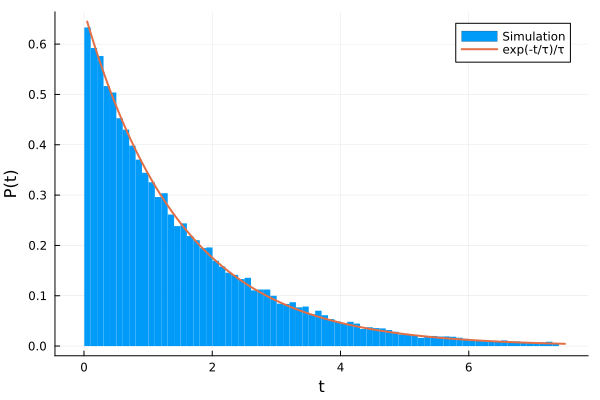
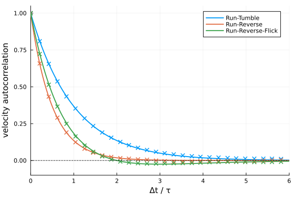
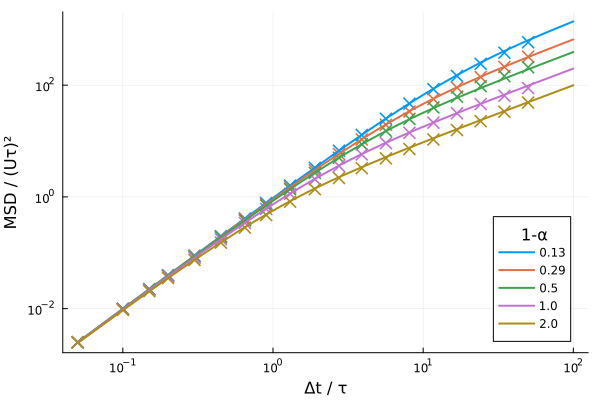

# Validation

## Run Time Distribution
[(examples/Analysis/run_distribution.jl)](https://github.com/mastrof/MicrobeAgents.jl/blob/main/examples/Analysis/run_distribution.jl)
Run times should be exponentially distributed, with ``\tau`` being the inverse
of the average turn rate.

The smaller the timestep ``\Delta t`` compared to the average run length ``\tau``,
the better the agreement between numerical results and theory.
A ratio ``\tau / \Delta t \sim 10`` is typically sufficient to have
a reasonable agreement.

## Velocity Autocorrelation Function

Velocity autocorrelation functions for the three motility patterns should
obey the following equations (Taktikos et al. PLoS ONE 2012):
``
\phi(t) = \begin{cases}
  \text{exp}(-t/\tau), & \text{run-tumble} \\
  \text{exp}(-2t/\tau), & \text{run-reverse} \\
  (1-t/2\tau)\text{exp}(-t/\tau), & \text{run-reverse-flick}
\end{cases}
``
(assuming no rotational diffusion, and that forward and backward mode have identical
timescales for the run-reverse-flick swimmer).

## Mean Squared Displacement

The mean squared displacement (MSD) for a run-tumble swimmer
with average turn angle ``\theta`` (and without rotational diffusion)
should obey the following equation (Taktikos et al. PLoS ONE 2012):

``
\text{MSD}(t) = 2v^2\tilde{\tau}^2 (t/\tilde{\tau} - 1 + e^{-t/\tilde{\tau}})
``
where ``\tilde{\tau} = \tau/(1-\cos\theta)``.

